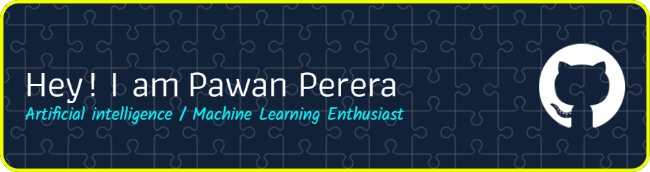

<h1 align="center">Hi 👋, I'm Pawan Perera</h1>
<h3 align="center">Computer Science undergraduate in Sri Lanka. Passionate about AI, ML, and Cybersecurity.</h3>

- 🌱 I’m currently working on **NLP , Machine Learning and AI projects**

- 💬 Ask me about **Large Language models, AI, Machine learning, Neural Networks, NLP**

- 📫 How to reach me **1pawanpinsara@gmail.com**

- 😎 Check my portfolio **[pawanperera.com](https://www.pawanperera.com/)**

- ⚡ Fun fact **Love to work with a team**

<h3 align="left">Connect with me:</h3>

###

  
  
  

###

 
<h3 align="left">Languages and Tools:</h3>

  
  
  
  
  
  
  
  
  
  
  
  
  
  
  
  
  
  
  
  
  
  
  
  
  
  
  
  
  
  
  
  
  
  
  
  
  
  
  
  
  
  
  
  
  
  
  
  
  
  
  
  
  
  
  
  
  
  
  
  
  
  
  
  
  
  
  
  
  

###

  
  

###

  

###

  

###

                                      
